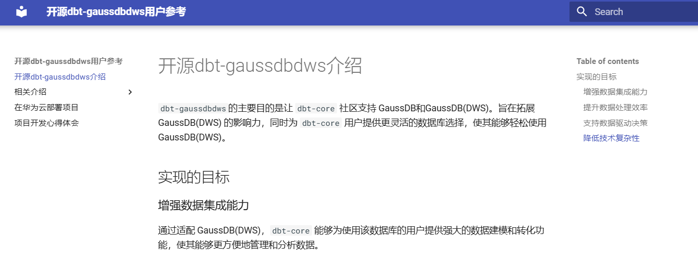

本项目是`Open Source for dbt-gaussdbdws`的参考文档源码。

# 如何使用

前提：

1. 安装git,参考[基于EulerOS配置GitHub](https://bbs.huaweicloud.com/blogs/441850)
2. 安装mkdocs,参考[MkDocs安装指南](https://www.mkdocs.org/#installation), 安装 Python、Pip、MkDocs


* 本地下载源码：dbt-gaussdbdws

  ```bash
  git clone https://github.com/pangpang20/opensource-dbt-gaussdbdws.git
  ```


* 安装主题: `pip install mkdocs-material`

* 启动本地WEB服务器并查看文档内容：

  ```bash
  cd zh_CN
  mkdocs serve
  ```

* 通过浏览器 `http://127.0.0.1:8000/index.html` 查看文档内容:

  
