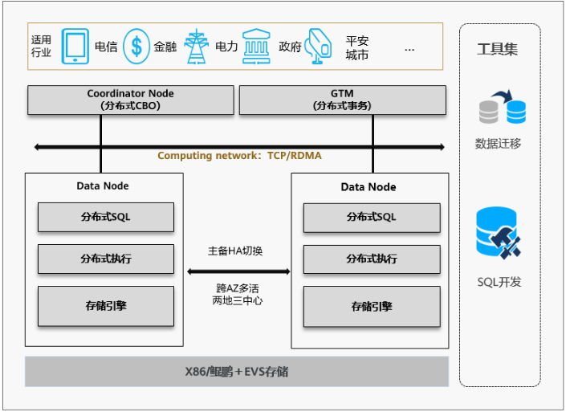
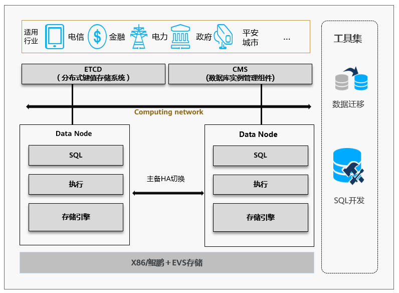

# GaussDB 介绍

## 什么是云数据库GaussDB

GaussDB是华为自主创新研发的分布式关系型数据库。该产品支持分布式事务，同城跨AZ部署，数据0丢失，支持1000+的扩展能力，PB级海量存储。同时拥有云上高可用，高可靠，高安全，弹性伸缩，一键部署，快速备份恢复，监控告警等关键能力，能为企业提供功能全面，稳定可靠，扩展性强，性能优越的企业级数据库服务。

在华为云官方可以访问 [GaussDB 的帮助文档](https://support.huaweicloud.com/wtsnew-gaussdb/index.html)

## 整体架构

### GaussDB分布式版形态整体架构

GaussDB分布式版形态整体架构如下：

图1 GaussDB分布式版形态整体架构图

- Coordinator Node：协调节点CN，负责接收来自应用的访问请求，并向客户端返回执行结果；负责分解任务，并调度任务分片在各DN上并行执行。
- GTM：全局事务管理器（Global Transaction Manager），负责生成和维护全局事务ID、事务快照、时间戳、Sequence信息等全局唯一的信息。
- Data Node：数据节点DN，负责存储业务数据、执行数据查询任务以及向CN返回执行结果。

### GaussDB 集中式形态整体架构

GaussDB 集中式形态整体架构如下：

图2 GaussDB集中式形态整体架构图

- ETCD：分布式键值存储系统（Editable Text Configuration Daemon）。用于共享配置和服务发现（服务注册和查找）。
- CMS：集群管理模块（Cluster Manager）。管理和监控分布式系统中各个功能单元和物理资源的运行情况，确保整个系统的稳定运行。
- Data Node：数据节点DN，负责存储业务数据、执行数据查询任务以及返回执行结果。

## 产品优势

- 高安全

GaussDB拥有TOP级的商业数据库安全特性，如下所示，能够满足政企和金融级客户的核心安全诉求。
数据动态脱敏，行级访问控制，密态计算。

- 健全的工具与服务化能力

GaussDB已经拥有华为云，商用服务化部署能力，同时支持DAS、DRS等生态工具。有效保障用户开发、运维、优化、监控、迁移等日常工作需要。

- 全栈自研

GaussDB基于鲲鹏生态，是当前国内唯一能够做到全栈自主可控的国产品牌。同时GaussDB能够基于硬件优势在底层不断进行优化，提升产品综合性能。

- 开源生态

GaussDB已经支持开源社区，并提供集中式版本下载。
