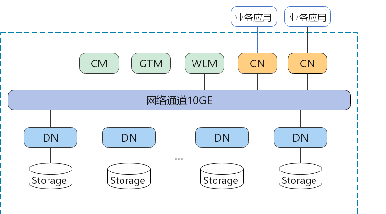

# GaussDB(DWS) 介绍

## 什么是是数据仓库服务GaussDB(DWS)

数据仓库服务GaussDB(DWS)是一种基于华为云基础架构和平台的在线数据分析处理数据库，提供即开即用、可扩展且完全托管的分析型数据库服务，兼容ANSI/ISO标准的SQL92、SQL99和SQL 2003语法，同时兼容PostgreSQL/Oracle/Teradata/MySQL等数据库生态，为各行业PB级海量大数据分析提供有竞争力的解决方案。

在华为云官方可以访问 [GaussDB(DWS) 的帮助文档](https://support.huaweicloud.com/wtsnew-dws/index.html)

## 集群逻辑架构

GaussDB(DWS)集群逻辑架构如下：

图1 集群逻辑架构图

- CM: 集群管理模块（Cluster Manager）。管理和监控分布式系统中各个功能单元和物理资源的运行情况，确保整个系统的稳定运行。
- GTM: 全局事务管理器（Global Transaction Manager），负责生成和维护全局事务ID、事务快照、时间戳等全局唯一的信息。
- WLM: 工作负载管理器（Workload Manager）。控制系统资源的分配，防止过量业务负载对系统的冲击而导致业务拥塞和系统崩溃。
- CN: 协调节点（Coordinator）。负责接收来自应用的访问请求，并向客户端返回执行结果；负责分解任务，并调度任务分片在各DN上并行执行。
- DN: 数据节点（Datanode）。负责存储业务数据（支持行存、列存、混合存储）、执行数据查询任务以及向CN返回执行结果。
- Storage: 服务器的本地存储资源，持久化存储数据。

## 产品优势

GaussDB(DWS)数据库内核自主研发，兼容PostgreSQL的数据库内核引擎，从单机OLTP数据库改造为企业级MPP（大规模并行处理）架构的OLAP分布式数据库，其主要面向海量数据分析场景。

GaussDB(DWS)与传统数据仓库相比，主要有以下特点与显著优势，可解决多行业超大规模数据处理与通用平台管理问题：

### 易使用

- 一站式可视化便捷管理

GaussDB(DWS)让您能够轻松完成从项目概念到生产部署的整个过程。通过使用GaussDB(DWS)管理控制台，您不需要安装数据仓库软件，也不需要部署数据仓库服务器，就可以在几分钟之内获得高性能、高可靠的企业级数据仓库集群。

- 与大数据无缝集成

您可以使用标准SQL查询HDFS、对象存储服务（Object Storage Service，OBS）上的数据，数据无需搬迁。

- 提供一键式异构数据库迁移工具

GaussDB(DWS)提供配套的迁移工具，可支持MySQL、Oracle和Teradata的SQL脚本迁移到GaussDB(DWS)。

### 高性能

- 云化分布式架构

GaussDB(DWS)采用全并行的MPP架构数据库，业务数据被分散存储在多个节点上，数据分析任务被推送到数据所在位置就近执行，并行地完成大规模的数据处理工作，实现对数据处理的快速响应。

- 查询高性能，万亿数据秒级响应

GaussDB(DWS)通过算子并行执行、向量化执行引擎实现指令在寄存器并行执行，以及LLVM动态编译减少查询时冗余的条件逻辑判断，助力数据查询性能提升。

GaussDB(DWS)支持行列混合存储，可以同时为用户提供更优的数据压缩比（列存）、更好的索引性能（列存）、更好的点更新和点查询（行存）性能。

- 数据加载快

GaussDB(DWS)提供了GDS极速并行大规模数据加载工具。

-列存下的数据压缩

对于非活跃的早期数据可以通过压缩来减少空间占用，降低采购和运维成本。

GaussDB(DWS)列存储压缩支持Delta Value Encoding、Dictionary、RLE 、LZ4、ZLIB等压缩算法，且能够根据数据特征自适应的选择压缩算法，平均压缩比7:1。压缩数据可直接访问，对业务透明，极大缩短历史数据访问的准备时间。

### 易扩展

- 按需扩展：Shared-Nothing开放架构，可随时根据业务情况增加节点，扩展系统的数据存储能力和查询分析性能。
- 扩容后性能线性提升：容量和性能随集群规模线性提升，线性比0.8。
- 扩容不中断业务：扩容过程中支持数据增、删、改、查，及DDL操作(Drop/Truncate/Alter table)，表级别扩容技术，扩容期间业务不中断、无感知。
- 支持在线升级：8.1.1及以上源版本支持大版本在线升级，8.1.3及以上源版本支持补丁在线升级，升级期间用户无需停止业务，业务存在闪级秒断。

### 高可靠

- 事务管理
  - 支持事务块，用户可以通过start transaction命令显式启动一个事务块。
  - 支持单语句事务，用户不显式启动事务，则单条语句就是一个事务。
  - 分布式事务管理。支持全局事务信息管理，包括gxid、snapshot、timestamp的管理，分布式事务状态管理，gxid溢出的处理。
  - 分布式事务支持ACID特性（Atomicity，Consistency，Isolation，Durability），数据强一致保证。
  - 支持分布式死锁预防，保证在出现死锁时自动解锁或者预防死锁。

- 全方位HA设计

GaussDB(DWS)所有的软件进程均有主备保证，集群的协调节点（CN）、数据节点（DN）等逻辑组件全部有主备保证，能够保证在任意单点物理故障的情况下系统依然能够保证数据可靠、一致，同时还能对外提供服务。

- 安全

GaussDB(DWS)支持数据透明加密，同时可与数据库安全服务（DBSS）对接，基于网络隔离及安全组规则，保护系统和用户隐私及数据安全。GaussDB(DWS)还支持自动数据全量、增量备份，提升数据可靠性。

### 低成本

- 按需付费：GaussDB(DWS)按实际使用量和使用时长计费。您需要支付的费率很低，只需为实际消耗的资源付费。
- 门槛低：您无需前期投入较多固定成本，可以从低规格的数据仓库实例起步，后续随时根据业务情况弹性伸缩所需资源，按需开支。
